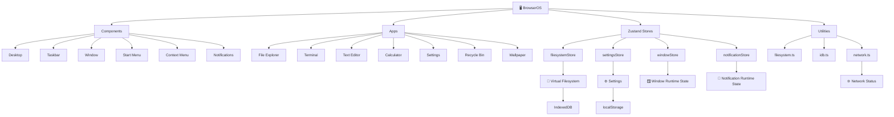
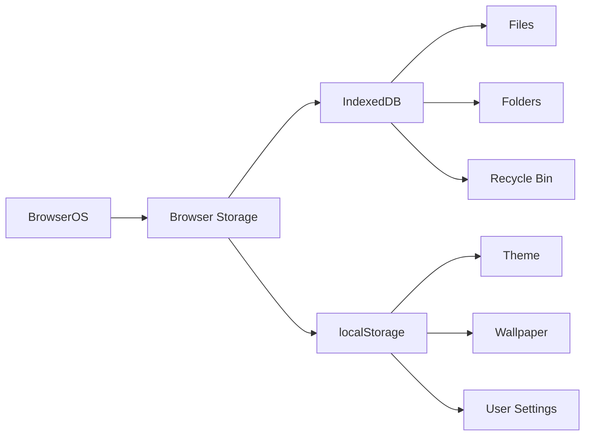
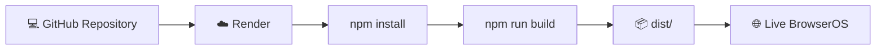

# 🖥️ BrowserOS

> A **browser-based simulated desktop operating system** built with **React, TypeScript, Vite, Zustand, and Lucide React**.

BrowserOS recreates a desktop-style operating system experience entirely inside the browser, including a virtual filesystem, applications, windows, taskbar, Start Menu, themes, wallpapers, notifications, and keyboard shortcuts.

---

## 🌐 Live Demo

### 🚀 [Open BrowserOS](https://vhbuyio-frontenddevelopment-internship.onrender.com/)

---

## ✨ Features

- 🖥️ **Desktop, Start Menu & Taskbar**
- 🪟 **Draggable, resizable, minimizable & maximizable windows**
- 📁 **Virtual File Explorer**
- 📂 **Folder and file creation**
- ✏️ **File and folder rename**
- 🗑️ **Recycle Bin with restore & permanent delete**
- 💻 **Simulated Terminal**
- 📝 **Text Editor with Save, Undo & Redo**
- 🧮 **Calculator**
- ⚙️ **Settings & theme customization**
- 🖼️ **Custom wallpapers & wallpaper cropping**
- 🔍 **Application search**
- 🔔 **Notifications**
- 💾 **Persistent browser storage**
- ⌨️ **Keyboard shortcuts**
- 📱 **Responsive interface**

---

## 🛠️ Tech Stack

| Technology | Purpose |
|---|---|
| **React** | UI and component architecture |
| **TypeScript** | Type-safe development |
| **Vite** | Development server and production build |
| **Zustand** | Application state management |
| **Lucide React** | UI icons |
| **IndexedDB** | Virtual filesystem persistence |
| **localStorage** | Settings persistence |
| **CSS** | Styling and responsive layout |

---

## 🏗️ Project Architecture



### 🧩 Architecture Overview

- **Components** handle the desktop shell and reusable UI.
- **Apps** provide individual BrowserOS applications.
- **Zustand Stores** manage application state.
- **Utilities** provide filesystem, IndexedDB and network-related functionality.
- **IndexedDB** stores the virtual filesystem.
- **localStorage** stores user settings such as themes and wallpapers.

---

## 📂 Project Structure

```text
Browser-Based-OS/
│
├── public/
│   └── browseros.svg
│
├── src/
│   │
│   ├── apps/
│   │   ├── Calculator/
│   │   │   └── Calculator.tsx
│   │   │
│   │   ├── FileExplorer/
│   │   │   └── FileExplorer.tsx
│   │   │
│   │   ├── RecycleBin/
│   │   │   └── RecycleBin.tsx
│   │   │
│   │   ├── Settings/
│   │   │   └── Settings.tsx
│   │   │
│   │   ├── Terminal/
│   │   │   └── Terminal.tsx
│   │   │
│   │   ├── TextEditor/
│   │   │   └── TextEditor.tsx
│   │   │
│   │   └── Wallpaper/
│   │       └── Wallpaper.tsx
│   │
│   ├── assets/
│   │   └── natureWallpapers.ts
│   │
│   ├── components/
│   │   ├── ContextMenu/
│   │   ├── CreateItemDialog/
│   │   ├── Desktop/
│   │   ├── Notifications/
│   │   ├── PropertiesDialog/
│   │   ├── StartMenu/
│   │   ├── Taskbar/
│   │   ├── WallpaperPicker/
│   │   └── Window/
│   │
│   ├── constants/
│   │   └── apps.ts
│   │
│   ├── hooks/
│   │   └── useKeyboardShortcuts.ts
│   │
│   ├── stores/
│   │   ├── filesystemStore.ts
│   │   ├── notificationStore.ts
│   │   ├── settingsStore.ts
│   │   └── windowStore.ts
│   │
│   ├── styles/
│   │   └── global.css
│   │
│   ├── types/
│   │   └── index.ts
│   │
│   ├── utils/
│   │   ├── filesystem.ts
│   │   ├── idb.ts
│   │   └── network.ts
│   │
│   ├── App.tsx
│   └── main.tsx
│
├── index.html
├── package.json
├── package-lock.json
├── tsconfig.json
├── tsconfig.app.json
├── vite.config.ts
├── .gitignore
└── README.md
```

---

## 🔄 Data Flow

### 📁 Virtual Filesystem

```text
User Action
     ↓
React Component / Application
     ↓
filesystemStore
     ↓
Virtual Filesystem
     ↓
IndexedDB
     ↓
Persistent Browser Data
```

### ⚙️ Settings

```text
User Changes Setting
        ↓
settingsStore
        ↓
localStorage
        ↓
BrowserOS UI
```

### 🪟 Window Management

```text
Application
     ↓
windowStore
     ↓
Open / Focus / Minimize / Maximize / Close
     ↓
Shared Window Components
```

### 🔔 Notifications

```text
Application / User Action
          ↓
notificationStore
          ↓
Notification Component
          ↓
BrowserOS Notification
```

---

## 💾 Browser Storage

BrowserOS does **not access the real computer filesystem**.

Instead, it uses browser storage to simulate an operating system environment.



### IndexedDB

Used for persistent virtual filesystem data such as:

- **Files**
- **Folders**
- **Recycle Bin**

### localStorage

Used for persistent settings such as:

- **Theme**
- **Wallpaper**
- **Taskbar settings**
- **Other UI preferences**

---

## 💻 Simulated Terminal

BrowserOS includes a **virtual terminal** that operates only on the BrowserOS virtual filesystem.

Supported commands include:

```text
help
ls
cd
pwd
mkdir
touch
cat
clear
echo
rm
date
```

> Terminal commands do **not** execute commands on the user's actual operating system.

---

## ⌨️ Keyboard Shortcuts

| Shortcut | Action |
|---|---|
| `Ctrl + S` | Save document |
| `Ctrl + Z` | Undo |
| `Ctrl + Y` | Redo |
| `Alt + Tab` | Switch between windows |
| `Windows / Meta` | Open Start Menu |
| `Escape` | Close Start Menu |

---

## ⚙️ Installation

### 1. Clone the Repository

```bash
git clone https://github.com/ManjeetPrabhakarRawat/vhbuyio-FrontendDevelopment-internship-ManjeetPrabhakarRawat-task2.git
```

### 2. Navigate to the Project

```bash
cd vhbuyio-FrontendDevelopment-internship-ManjeetPrabhakarRawat-task2
```

### 3. Install Dependencies

```bash
npm install
```

---

## 🚀 Run Development Server

```bash
npm run dev
```

Vite will provide a local development URL.

---

## 📦 Production Build

```bash
npm run build
```

The optimized production files are generated inside:

```text
dist/
```

---

## 🔎 Preview Production Build

```bash
npm run preview
```

---

## ☁️ Deployment

BrowserOS is deployed as a **Render Static Site**.



### 🌐 Live Application

**[🚀 Open BrowserOS](https://vhbuyio-frontenddevelopment-internship.onrender.com/)**

---

## ⚠️ Limitations

BrowserOS is a **browser-based simulation**, not a real operating system.

- ❌ Does not access the **real computer filesystem**
- ❌ Does not execute **real OS commands**
- ❌ Terminal commands operate only on the **virtual filesystem**
- ⚠️ Browser security restrictions apply to certain system-level features
- ⚠️ The **network status API** requires a compatible Node/Vite environment
- ⚠️ Static hosting cannot directly execute Windows-specific `netsh` commands

---

## 📌 Project Purpose

This project was developed as part of a **Frontend Development Internship** to demonstrate practical experience with:

- **React.js**
- **TypeScript**
- **Modern frontend architecture**
- **State management**
- **Browser storage**
- **Responsive UI development**
- **Interactive application design**
- **Component-based development**

---

## 👨‍💻 Developer

### **Manjeet Prabhakar Rawat**

**B.Tech Computer Science & Engineering**

### 🔗 Links

- 🌐 **[Live Demo](https://vhbuyio-frontenddevelopment-internship.onrender.com/)**
- 💻 **[GitHub Repository](https://github.com/ManjeetPrabhakarRawat/vhbuyio-FrontendDevelopment-internship-ManjeetPrabhakarRawat-task2)**

---

## ⭐ BrowserOS

> **A desktop experience, recreated entirely in the browser.**